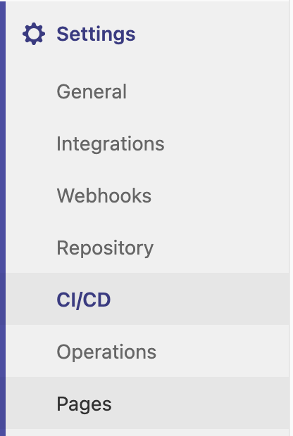
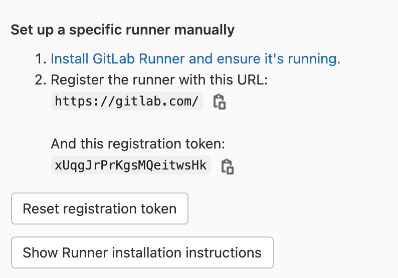
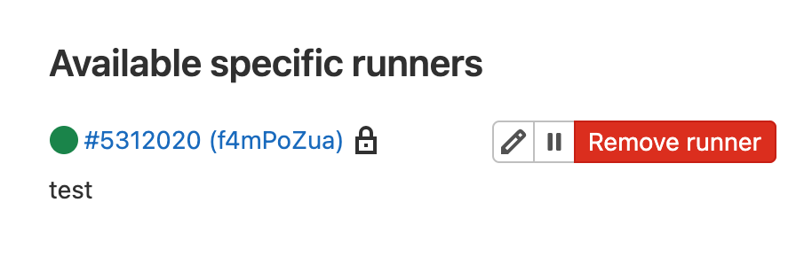

# Check GitLab Settings
Go to the project on GitLab and navigate to the `Settings`. From the settings click on `CI/CD` as shown in the image below. 

When you are in the CI/CD go to the Runner by clicking on expand. From there you will get the URL and token, which are used in the second part of the registration.

# Register the Runner 
Now it is time to make GitLab aware of our new runner. Run the following command: `gitlab-runner register`{{execute}} and do the following:
1. Add the URL from GitLab and press enter.
2. After adding URL, copy the token and paste it in the terminal. 
2. Next, add description for the runner. This can be changed later on in the GitLab UI.
3. The terminal will then ask you to enter the tags associated with the runner, right now 
you can just press enter. Don't worry this can be changed later on in the GitLab UI.
4. Now you have an option to choose a runner executor. For the sake of this tutorial just write shell and press enter to continue.
After everything is completed, refresh the GitLab page and you will see the new runner (see image below).
   

   